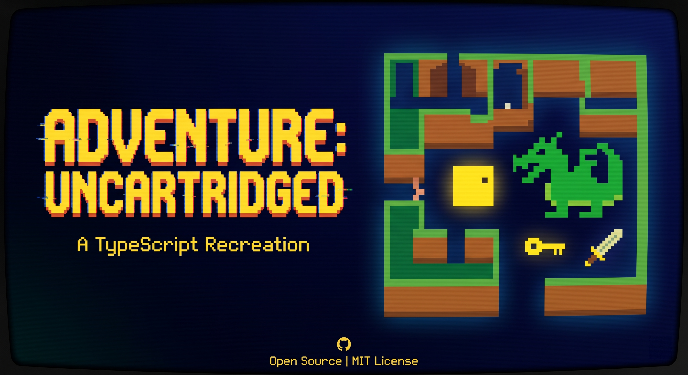

<h1 align="center">
  
</h1>

<p align="center">
  <em>From ROM to DOM</em>
</p>

<p align="center">
   
  <a href="https://github.com/jeffnyman/playwright-hudl/blob/main/LICENSE"></a>
</p>

<p align="center"><a href="https://github.com/jeffnyman/adventure-uncartridged/actions/workflows/ci.yml"></a></p>

<div align="center"></div>

### What Is This?

This project is my attempt to recreate the Atari 2600 game _Adventure_ in TypeScript so it's easily playable in a browser. My goal is complete fidelity with the original assembled game, the source code of which is [included in this repository](docs/adventure.asm).

## How to Play

You can play the game directly in your browser. No installation needed!

**[Play Adventure: Uncartridged online](https://jeffnyman.github.io/adventure-uncartridged/)**

Your goal is to find the **Enchanted Chalice** and return it to the **Golden Castle**. To do that, you'll need to explore a maze of castles and catacombs, gather items, and survive three dragons.

**Items**

| Item   | Purpose                                             |
| ------ | --------------------------------------------------- |
| Sword  | Defeat dragons (carry it to slay them on contact)   |
| Bridge | Walk through walls                                  |
| Keys   | Unlock castles (each key opens one specific castle) |
| Magnet | Attract nearby objects to you                       |

**Enemies**

- **Yorgle** (yellow) — cowardly; flees from the sword and the gold chalice
- **Grundle** (green) — aggressive; hunts you relentlessly
- **Rhindle** (red) — fastest of all; difficult to outrun

**The Bat** will steal items at random and scatter them across the map.

The [original Atari manual](docs/adventure-manual.pdf) is included here for historical reference. It describes the physical cartridge and joystick controls, which don't map directly to how this browser version is played.

**Game levels** select how the world is laid out:

- **Game 1** — simplified map; good for learning the layout and item locations
- **Game 2** — full map with all castles and catacombs
- **Game 3** — full map with randomized item placement each playthrough

Dragon speed and aggression are controlled separately by the **difficulty switches**, independent of which game level you choose.

## Reference Implementation

This project traces its lineage through several prior efforts to bring Adventure off the cartridge.

The foundation is the [6502 assembly source](https://6502disassembly.com/2600-adventure/Adventure.bin.html) included in this repository, which is a heavily commented disassembly created by Joel D. Park in June 2002, itself building on his earlier reverse-engineering work from November 1994. Park's disassembly turned a binary ROM into readable, annotated source code, which made understanding the original game's logic possible at all.

In 2006, Peter Hirschberg ported that disassembly to C++, releasing it as ["Adventure: Revisited"](https://sourceforge.net/projects/adventurerevisited/). That port was genuinely useful for understanding how the original game mechanics translated out of assembly.

In 2019, Hirschberg produced a TypeScript implementation. While the intent was right, the implementation was too far from idiomatic TypeScript to build on. This project is a ground-up rewrite rather than a port of that work.

I also found a great resource by Allen C. Huffman called [Exploring Atari VCS/2600 Adventure](https://subethasoftware.com/2020/12/23/exploring-atari-vcs-2600-adventure-part-1/).

## Contributing

This project uses [Vite Plus](https://viteplus.dev) as its unified toolchain. All commands below go through the `vp` CLI. To contribute, it's highly recommended to install it before proceeding.

### Setup

Clone the repository and install dependencies:

```sh
vp install
```

This also runs the `prepare` script, which calls `vp config` to install the Git hooks in `.vite-hooks/` automatically.

### Development

Start the dev server:

```sh
vp dev
```

### Before Committing

The pre-commit hook runs `vp staged`, which lints and formats only the files you have staged. It does **not** run the test suite. To catch test failures before pushing, run the full check locally:

```sh
vp check && vp test
```

Commit messages must follow the [Conventional Commits](https://www.conventionalcommits.org/) specification and `commitlint` enforces this on every commit.

### Build

To verify a production build locally:

```sh
vp build
```

### Branch Protection

The `main` branch requires linear history. When working on a feature branch, rebase onto `main` rather than merging it:

```sh
git fetch origin
git rebase origin/main
```

Standard merge commits will be rejected. GitHub will only offer "Rebase and merge" or "Squash and merge" when submitting a pull request.

## 👨‍💻 Author

<p align="center">
  Made with 🤍 by <a href="https://github.com/jeffnyman">Jeff Nyman</a>
</p>

<p align="center">
  
</p>

<p align="center">
  Written in TypeScript ✨ Compiles to JavaScript for distribution.
</p>

<p align="center">
  <a href="https://testerstories.com" target="_blank" >
    
  </a>
</p>
<p align="center">
  <a href="https://www.linkedin.com/in/jeffnyman/" target="_blank" >
    
  </a>
</p>

## ☦️ Doxazein (δοξάζειν)

<p align="center">
  חֶסֶד וֶאֱמֶת אַל־יַעַזְבֻךָ קָשְׁרֵם עַל־גַּרְגְּרֹתֶיךָ כָּתְבֵם עַל־לוּחַ לִבֶּךָ
</p>

<p align="center">
"Let not mercy and truth forsake thee:<br>
bind them about thy neck;<br>
write them upon the table of thine heart."<br>
<em>Proverbs 3:3</em>
</p>

## 🕹️ Acknowledgements

This project stands on the shoulders of an 8-bit legend: **Adventure**, which was written by Warren Robinett and published by Atari. The game was actually finished in 1979 but was not released until 1980. This reimplementation is a fan-made tribute to the game that proved a handful of colored pixels could conjure dragons, labyrinths, and one of gaming's first Easter eggs. This was the game that made a generation believe a little square dot was a hero.

## ⚖️ License

The code used in this project is licensed under the [MIT license](https://github.com/jeffnyman/adventure-uncartridged/blob/main/LICENSE).

**Note:** This license applies _only_ to the code in this repository. The original game concept, design, and any original assets belong to their respective copyright holders.

✨ Long live the classics.
